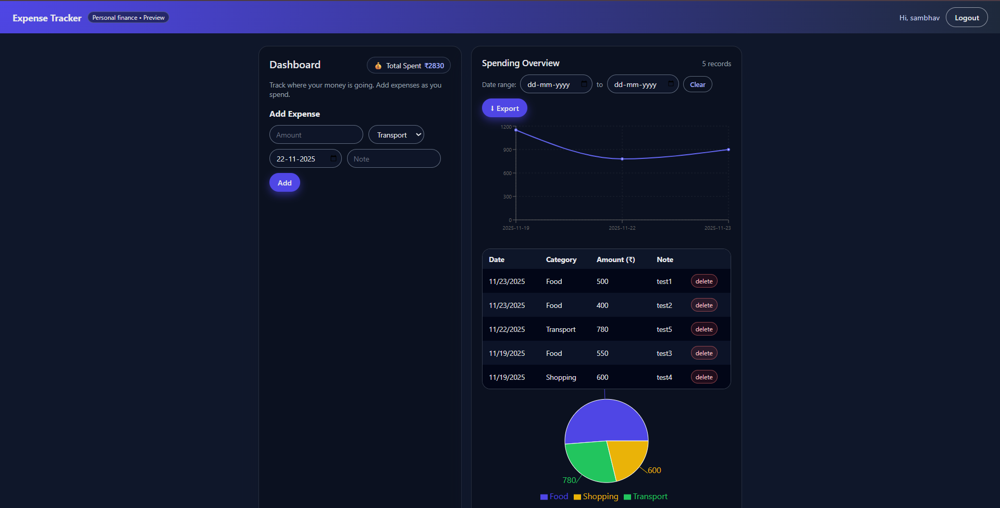

# 💰 Expense Tracker Dashboard

A modern **full-stack personal finance management web application** that allows users to securely track, analyze, and manage their daily expenses with real-time visual insights.

This project features authentication, dynamic dashboards, interactive charts, and export functionality — designed with a premium dark UI and built for performance and usability.

---

## 🚀 Live Features

✅ Secure User Authentication (Register & Login)
✅ Persistent Login Sessions
✅ Add, View & Delete Expenses
✅ Real-time Total Spending Calculation
✅ Category-wise Pie Chart Analytics
✅ Date Range / Month Filtering
✅ Daily Spending Line Chart
✅ Export Expenses to Excel (CSV)
✅ Responsive Dark-Themed UI

---

## 🖥️ Preview

> Modern dashboard with analytics and charts

- Interactive Pie Chart for category distribution
- Line Graph for daily expense trends
- Filter by custom date range
- Export data for offline use

---

## 🛠️ Tech Stack

### Frontend

- React.js
- React Router
- Recharts
- Axios
- CSS (Custom Dark Theme UI)

### Backend

- Node.js
- Express.js
- JWT Authentication
- Firebase Firestore

---

## 📂 Folder Structure

```
expense_tracker/
│
├── client/
│   ├── src/
│   │   ├── components/
│   │   ├── pages/
│   │   ├── api/
│   │   ├── context/
│   │   └── App.jsx
│
├── server/
│   ├── controllers/
│   ├── routes/
│   ├── config/
│   └── index.js
```

---

## ⚙️ Installation & Setup

### 1. Clone the repository

```bash
git clone https://github.com/your-username/expense-tracker.git
cd expense-tracker
```

### 2. Install Backend Dependencies

```bash
cd server
npm install
```

Create a `.env` file in `/server`:

```
PORT=5000
JWT_SECRET=your_secret_key
```

Add your Firebase service account JSON and configure Firestore.

Run backend:

```bash
npm run dev
```

### 3. Install Frontend Dependencies

```bash
cd ../client
npm install
npm start
```

Application will run at:

```
Frontend: http://localhost:3000
Backend:  http://localhost:5000
```

---

## 📊 Usage

1. Register or Login
2. Add expenses with category, date & notes
3. View real-time analytics & charts
4. Filter by date range
5. Export reports to Excel

---

## 🔐 Authentication

- JWT-based secure authentication
- Session persistence using localStorage
- Protected routes with auto-redirect

---

## ✨ Future Enhancements

- Budget limit alerts
- Monthly statistics report
- AI spending insights
- Multi-user household sharing
- Mobile app version

---

## 🧑‍💻 Author

**Sambhav Shadangi**

- Full Stack Developer
- Passionate about UI/UX and scalable systems

---

## ⭐ If you like this project

Give it a star on GitHub and feel free to fork or contribute!

---

## 📸 Screenshots



---

### ✅ Portfolio Value

This project demonstrates:

- Full-stack architecture understanding
- Secure authentication systems
- Data visualization skills
- Modern UI design principles

---

> Built with ❤️ for financial clarity and productivity

